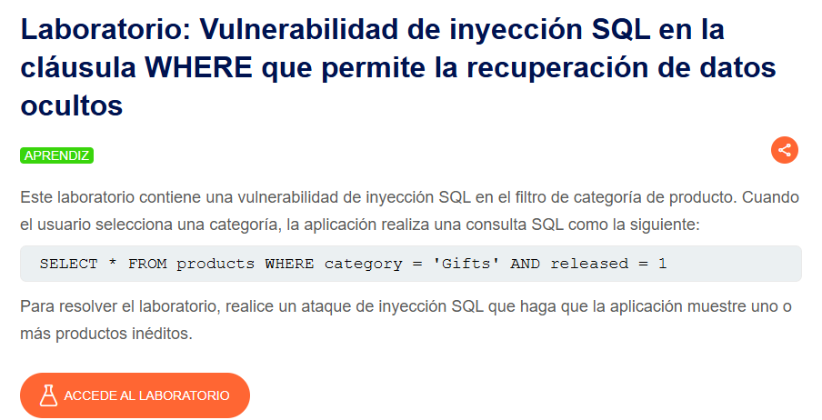
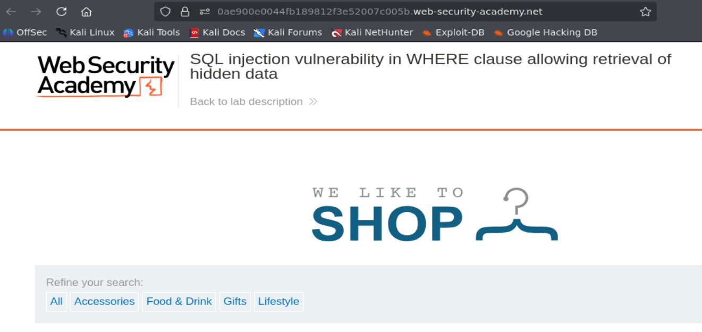
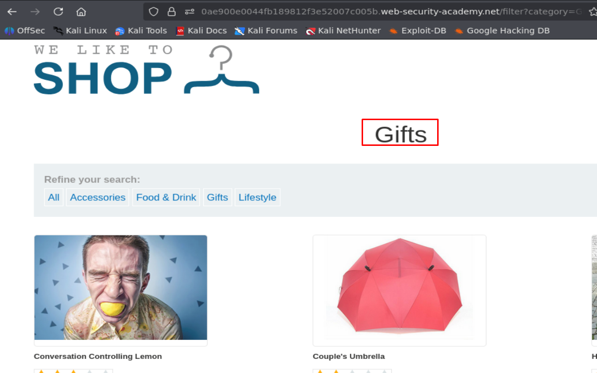
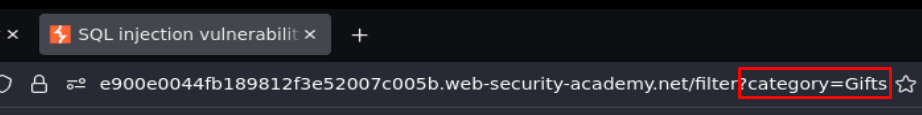
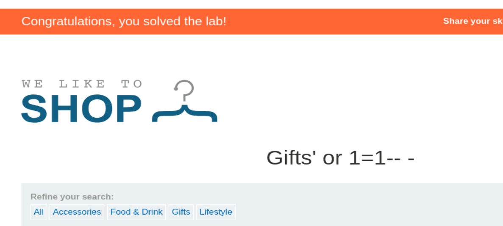

## SQL injection vulnerability in WHERE clause allowing retrieval of hidden data

  

Accedemos al laboratorio:

  

Si hacemos click en las categorías, veremos que el contenido que devuelve la web cambia, por lo que podemos intuir que se está realizando una consulta a datos por detrás:

  

Vemos que en la web podemos manejar el campo de categorías a través de la URL:

  

Podemos utilizar payloads simples, como probar **' or 1=1-- -** (payload popular y muy utilizado para comprobar posibles inyecciones SQL):

  

Hemos resuelto el laboratorio, ya que se ha realizado correctamente la inyección SQL para mostrar todos los datos de la base de datos.
