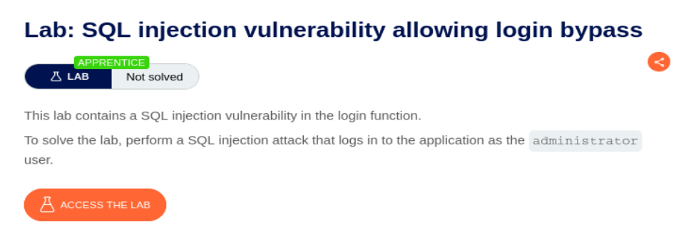
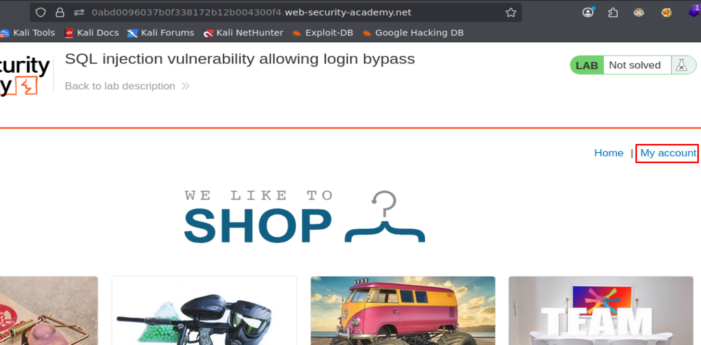
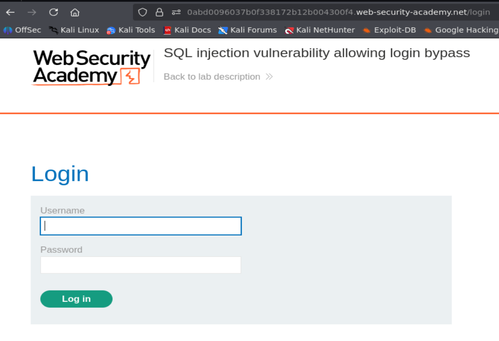
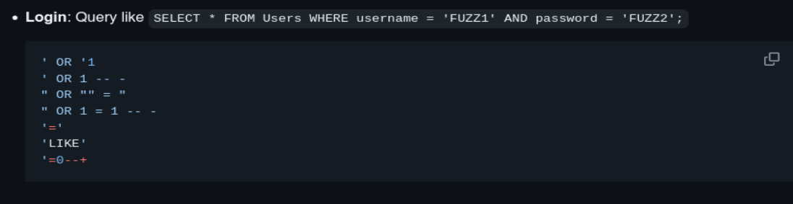
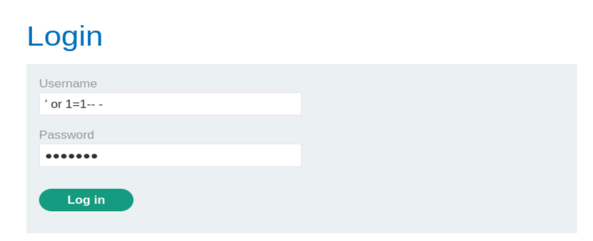
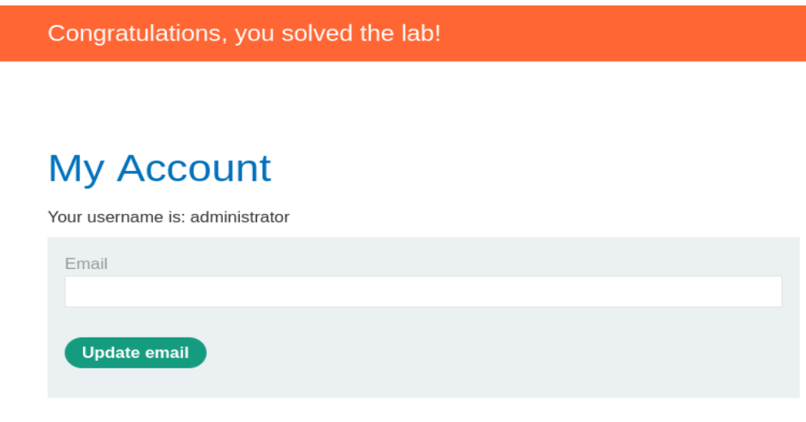

## SQL injection vulnerability allowing login bypass

<p align="center">
  
</p>

Accedemos al laboratorio y vemos que hay una sección de inicio de sesión:

<p align="center">
  
</p>

Nos encontramos ante un panel de login. Estos paneles suelen funcionar mediante la consulta a una base de datos:

<p align="center">
  
</p>

Podemos guiarnos del recurso PayloadAllTheThings para tratar de hacer un Bypass del panel de autenticación (en este caso vamos a pensar que la base de datos es MYSQL):

```http
https://github.com/swisskyrepo/PayloadsAllTheThings/blob/master/SQL%20Injection/MySQL%20Injection.md#mysql-testing-injection
```

<p align="center">
  
</p>

Puede que esa consulta de arriba sea la que se está realizando en el panel de Login, por lo que vamos a probar el payload `' or 1=1-- -` (payload típico y muy popular) para ver si podemos hacer Bypass del panel de autenticación:

<p align="center">
  
</p>

Hemos podido realizar el Bypass de manera correcta y ahora somos el usuario Administrator:

<p align="center">
  
</p>


