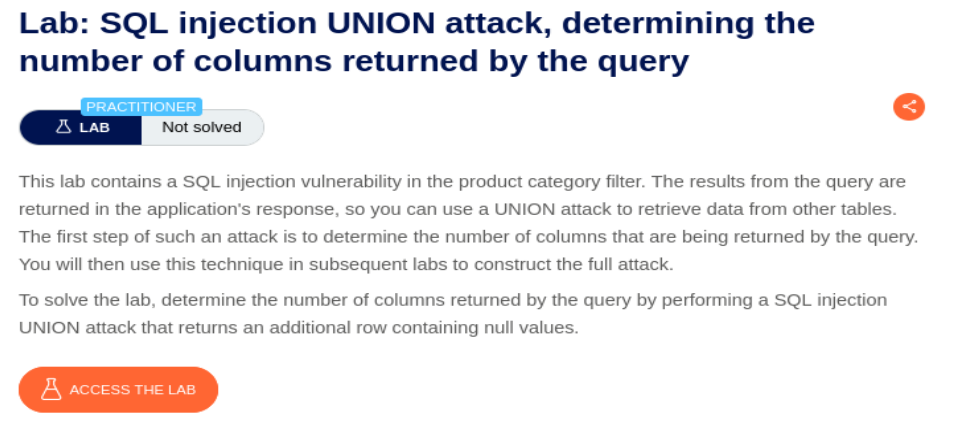
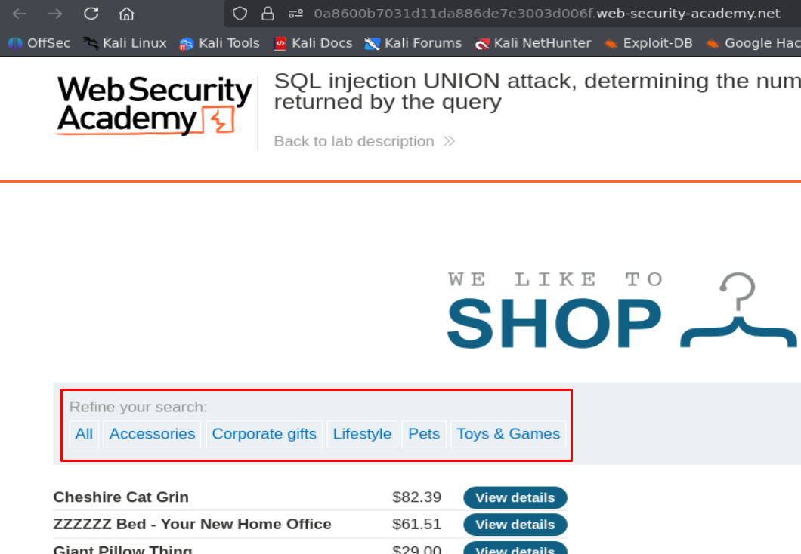
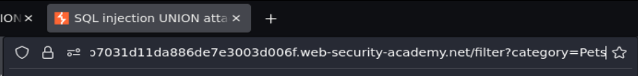
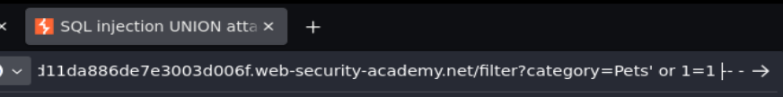
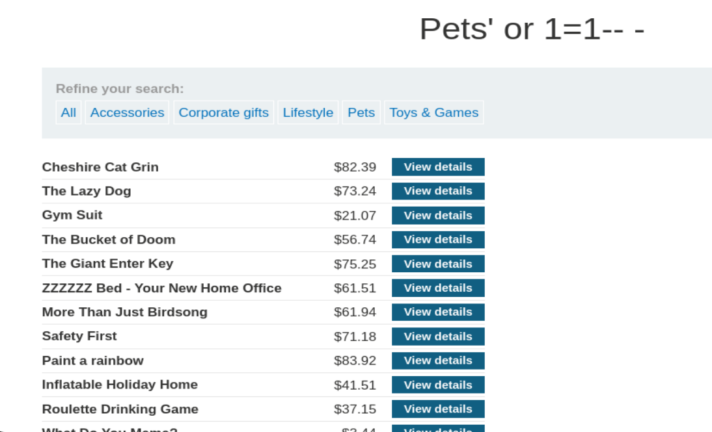
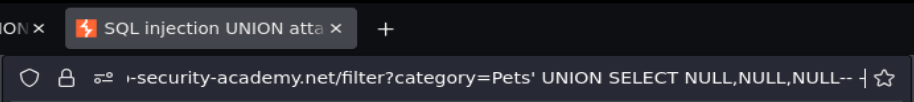
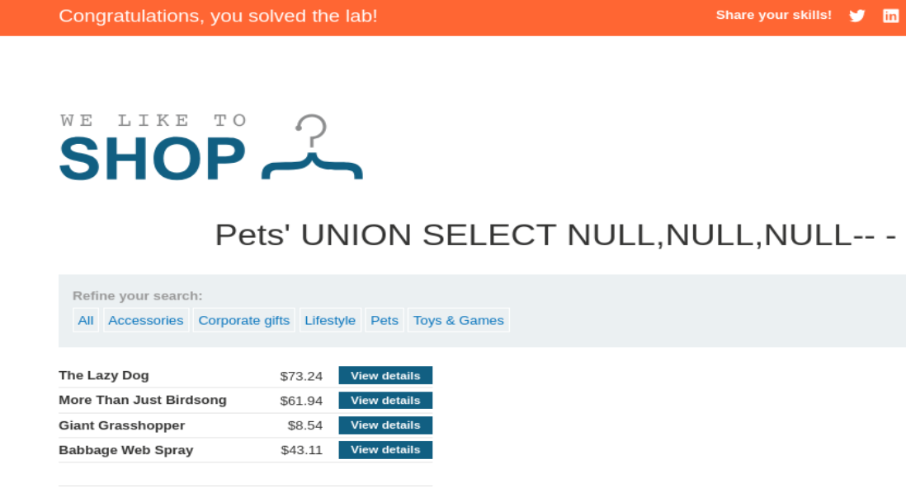

## SQLI UNION attack determining the number of columns returned by the query

  

Accedemos al laboratorio y vemos que hay botones para filtrar datos por categoría:

  

Vemos que la selección de categoría queda reflejado en la URL:

  

Vamos a usar el tipico payload `' or 1=1-- -` para ver si nos devuelve todos los datos posibles y es vulnerable a SQL Injection:

  

  

La página nos ha devuelto todos los datos de la base de datos sin dar ningún error, por lo que la aplicación web es vulnerable a SQL Injection. 

Ahora vamos a intentar conocer el número de columnas que devuelve la consulta SQL que hay por detrás mediante el payload `' UNION SELECT NULL,NULL,...-- -` (vamos añadiendo NULL, hasta que deje de dar error, que será cuando la Query concatenada con UNION haya coincidido con el número de columnas de la Query tramitada por la aplicación web):

  

  

>Vemos que ha dejado de dar error al tercer NULL, por lo que la Query tramitada por detrás en la aplicación web devuelve 3 columnas.

