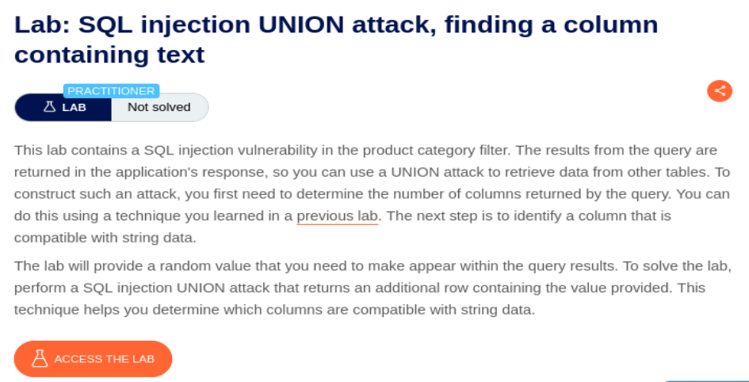
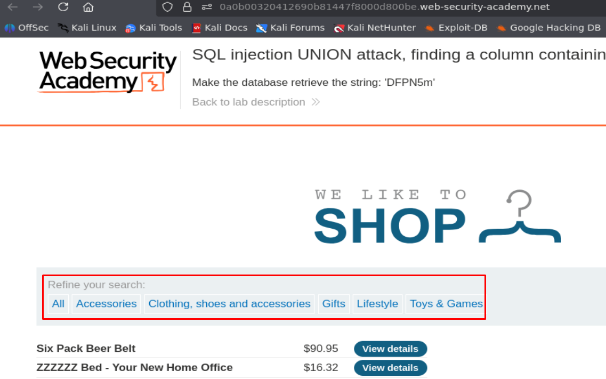
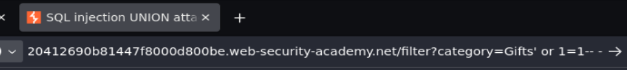
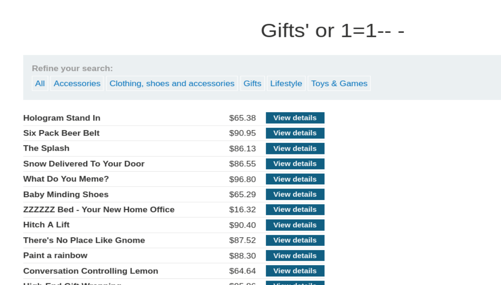
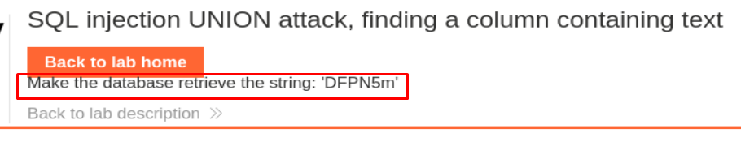
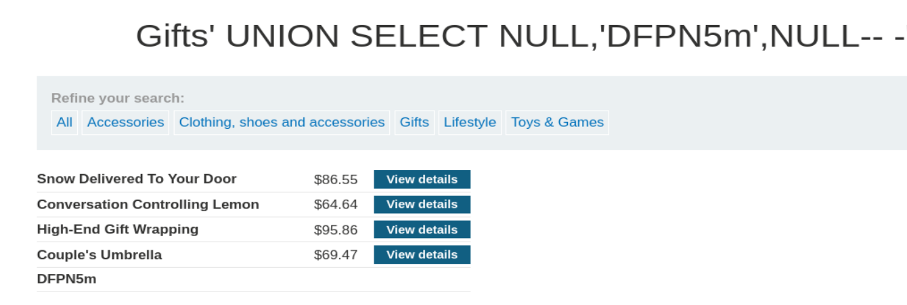

## SQLI UNION attack finding a column containing text

  

Accedemos al laboratorio y vemos que hay botones para filtrar datos por categoría:

  

Vemos que la selección de categoría queda reflejado en la URL:

  

Vamos a usar el tipico payload `' or 1=1-- -` para ver si nos devuelve todos los datos posibles y es vulnerable a SQL Injection:

  

  

La página nos ha devuelto todos los datos de la base de datos sin dar ningún error, por lo que la aplicación web es vulnerable a SQL Injection. Ahora vamos a pasar a lo importante del ejercicio, la web nos pide hacer que la base de datos nos devuelva un valor en String:

  

Ahora vamos a tratar de encontrar cual es la columna que contiene datos de tipo VARCHAR mediante el Payload `' UNION SELECT NULL,'DFPN5m',NULL-- -` (si falla, cambiamos de posición el texto hasta que deje de dar error y coincida con la columna exacta):

  

  

Hemos conseguido resolver el laboratorio:

  

