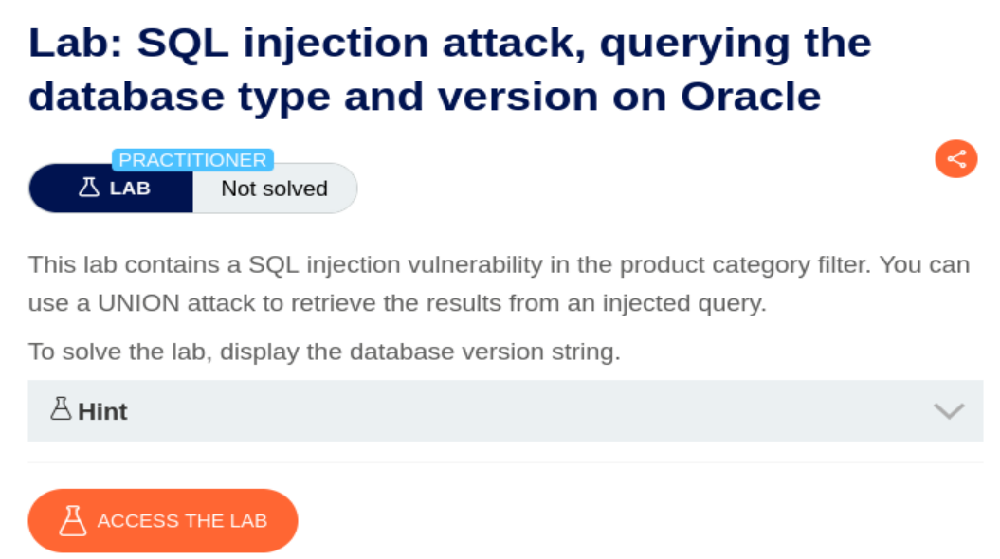
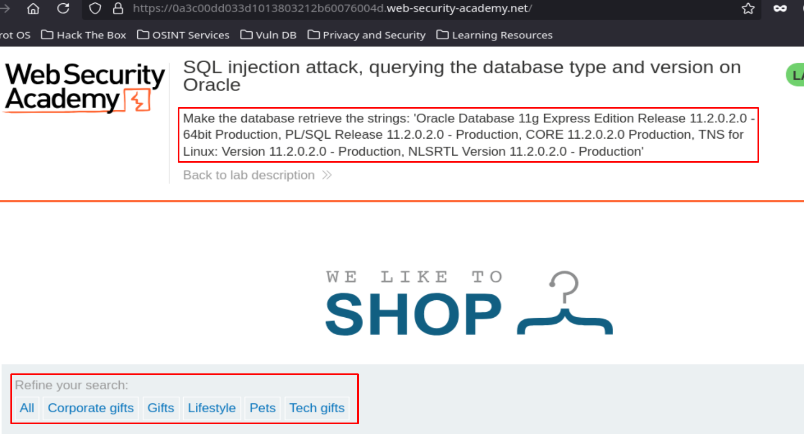
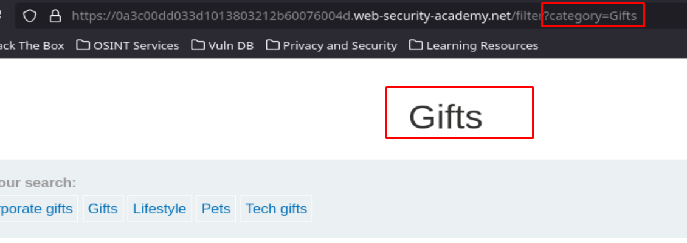
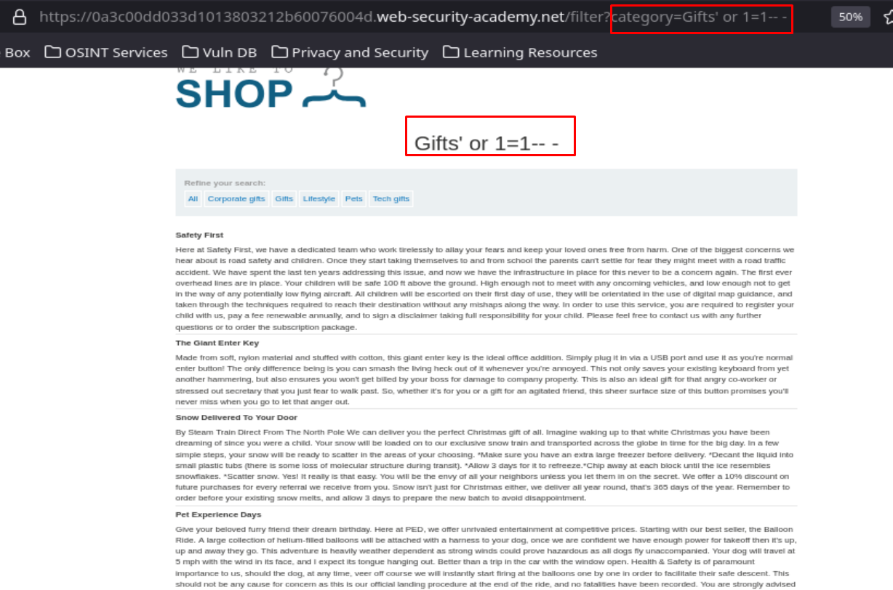
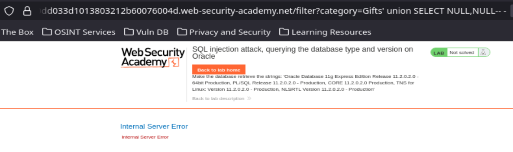
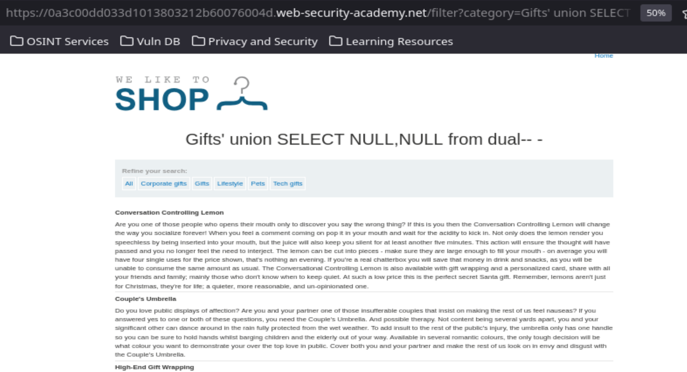
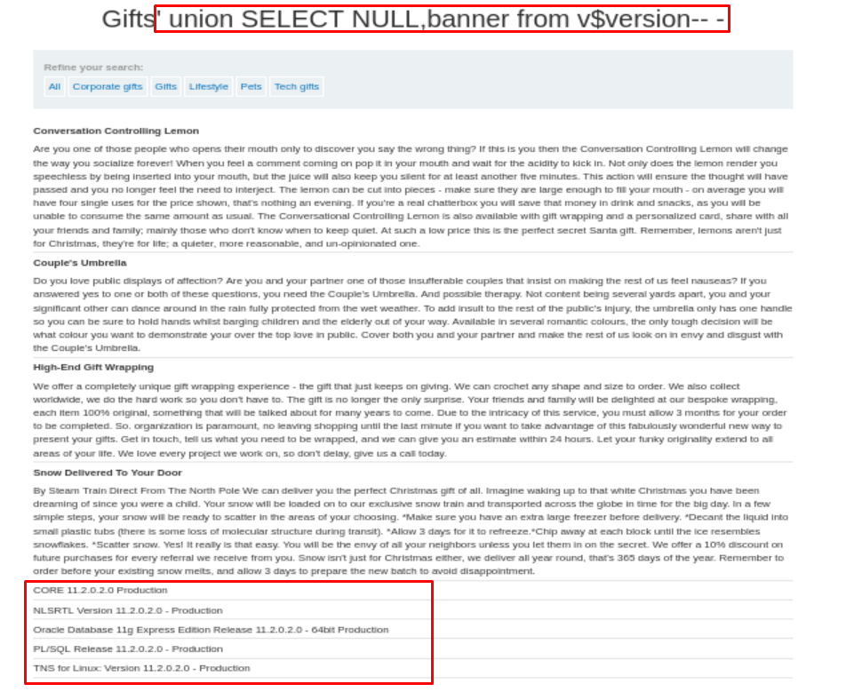
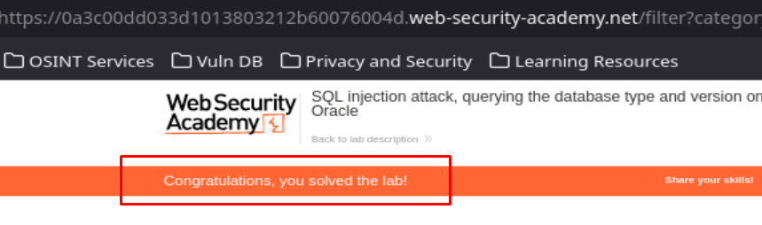

## SQL injection attack, querying the database type and version on Oracle

<p align="center">
  
</p>

Accedemos al laboratorio y vemos que hay botones para filtrar datos por categoría y el enunciado de lo que nos pide el ejercicio:

<p align="center">
  
</p>

Vemos que la selección de categoría queda reflejado en la URL:

<p align="center">
  
</p>

Vamos a usar el tipico payload `' or 1=1-- -` para ver si nos devuelve todos los datos posibles y es vulnerable a SQL Injection:

<p align="center">
  
</p>

La página nos ha devuelto todos los datos de la base de datos sin dar ningún error, por lo que la aplicación web es vulnerable a SQL Injection. 

Ahora vamos a tratar de determinar el número de columnas que devuelve la web:

```SQL
' UNION SELECT NULL,NULL-- -
```

> Debemos ir añadiendo o quitando NULL, hasta que deje de dar error (significa que la consulta inyectada ha coincidido con el numero de columnas que la web devuelve)

<p align="center">
  
</p>

No ha parado de dar errores a pesar de que el campo es claramente vulnerable a SQL Injection, por lo que quiza el problema sea que la base de datos es Oracle y por lo tanto nos da error a no ser que pongamos una tabla de la que sacar los datos:

```SQL
' UNION SELECT NULL,NULL FROM dual-- -
```

> La tabla DUAL es una tabla especial de una sola columna presente de manera predeterminada en todas las instalaciones de bases de datos de Oracle y cuya función es poder ejecutar consultas que **no necesitan una tabla real**

<p align="center">
  
</p>

Seguimos el cheat sheet oficial de PortSwigger para ver la consulta que nos permite volcar la versión de Oracle:

```http
https://portswigger.net/web-security/sql-injection/cheat-sheet
```

```SQL
' UNION SELECT NULL,banner from v$version-- -
```

<p align="center">
  
</p>

Hemos resuelto el laboratorio:

<p align="center">
  
</p>

