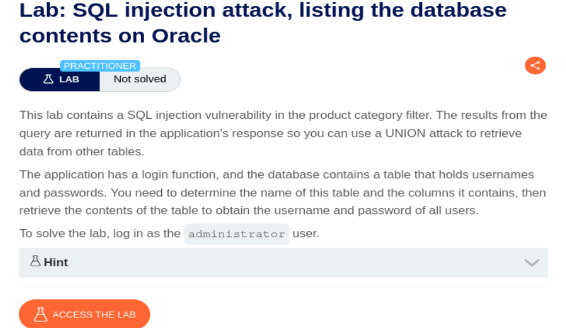
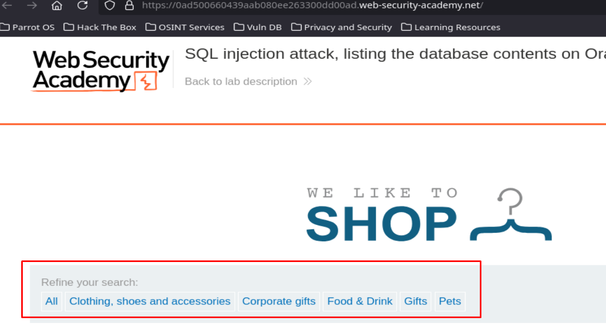
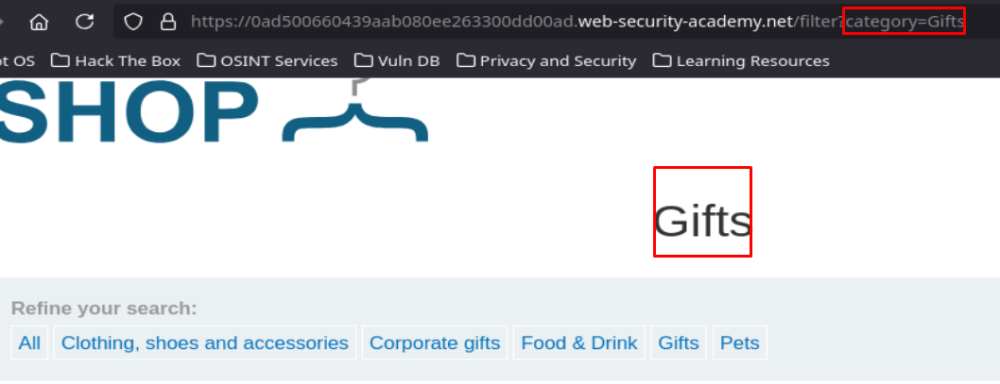
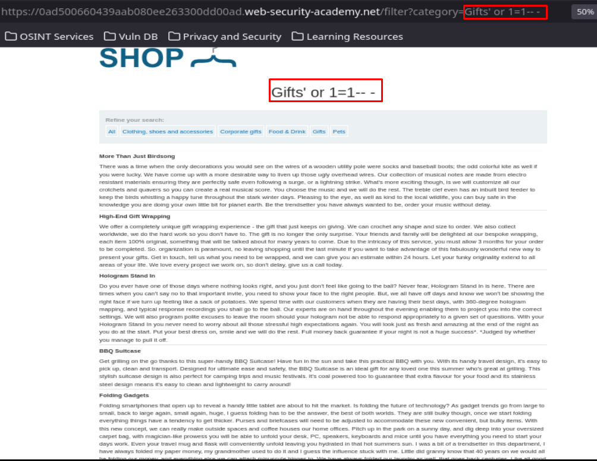
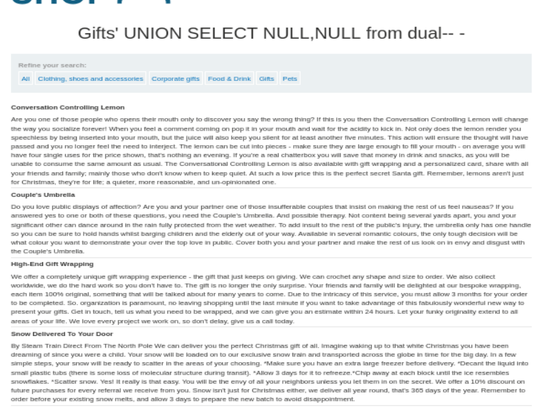
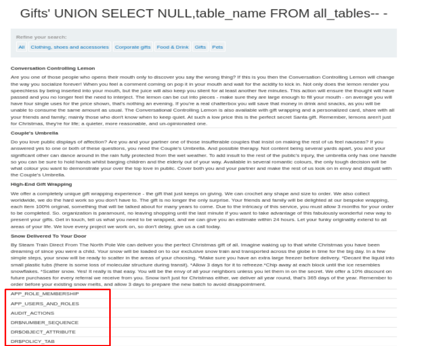
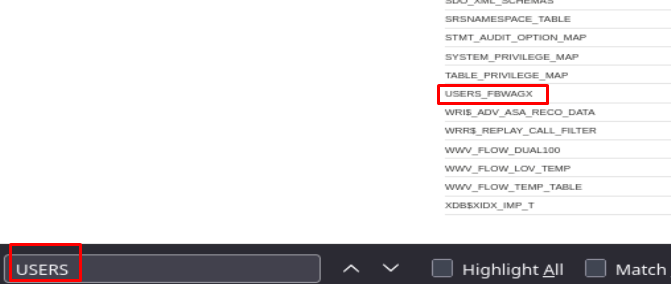
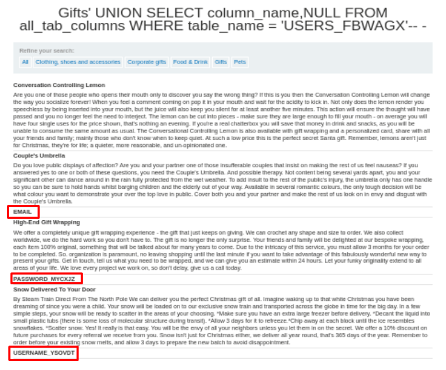
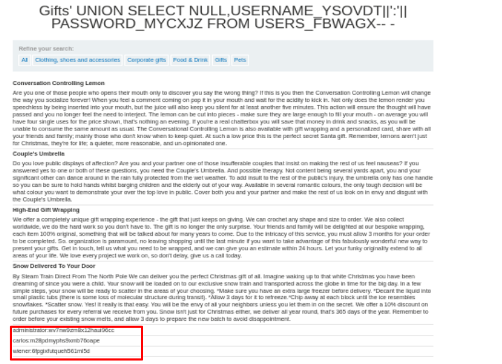
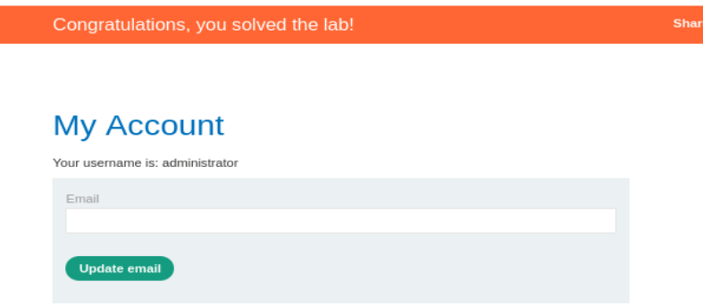

## SQL injection attack, listing the database contents on Oracle

<p align="center">
  
</p>

Accedemos al laboratorio y vemos que hay botones para filtrar datos por categoría:

<p align="center">
  
</p>

Vemos que la selección de categoría queda reflejado en la URL:

<p align="center">
  
</p>

Vamos a usar el tipico payload `' or 1=1-- -` para ver si nos devuelve todos los datos posibles y es vulnerable a SQL Injection:

<p align="center">
  
</p>

La página nos ha devuelto todos los datos de la base de datos sin dar ningún error, por lo que la aplicación web es vulnerable a SQL Injection. 

Ahora vamos a tratar de determinar el número de columnas que devuelve la web (recuerda que en Oracle siempre hay que hacer referencia a una tabla, para ello usamos la tabla dual, la cual es una tabla comodín usada para consultas sin disponer de una tabla real):

```SQL
' UNION SELECT NULL,NULL from dual-- -
```

> Debemos ir añadiendo o quitando NULL, hasta que deje de dar error (significa que la consulta inyectada ha coincidido con el numero de columnas que la web devuelve)

<p align="center">
  
</p>

Ahora sabiendo el número de columnas que devuelve la consulta que viaja por detrás en la web, vamos a enumerar las tablas existentes usando el siguiente payload:

```SQL
' UNION SELECT NULL,table_name FROM all_tables-- -
```

<p align="center">
  
</p>

Podemos observar una tabla llamada **USERS_FBWAGX** cuando filtramos mediante CTRL+F:

<p align="center">
  
</p>

Ahora vamos a obtener el nombre de las columnas de la tabla de usuarios:

```SQL
UNION SELECT column_name,NULL FROM all_tab_columns WHERE table_name = 'USERS_FBWAGX'-- -
```

<p align="center">
  
</p>

Ahora sabemos que hay una tabla llamada Users, así que vamos a intentar volcar el nombre de las columnas de esa tabla mediante el siguiente Payload:

```SQL
' UNION SELECT column_name,NULL FROM information_schema.columns WHERE table_schema='public' and table_name='users_nbexgz'-- -
```

<p align="center">
  
</p>

Ahora obtenemos los datos de usuario y contraseña mediante el siguiente payload:

```SQL
' UNION SELECT NULL,USERNAME_YSOVDT||':'||PASSWORD_MYCXJZ FROM USERS_FBWAGX-- -
```

<p align="center">
  
</p>

Ahora tenemos las credenciales del administrador, por lo que podemos tratar de iniciar sesión y resolver el laboratorio:

<p align="center">
  
</p>


