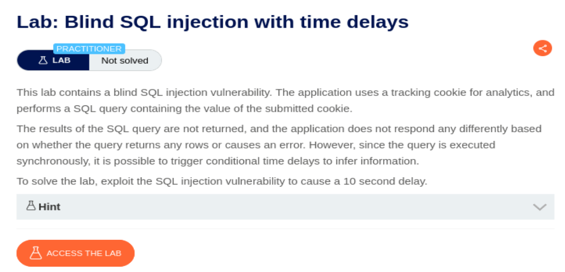
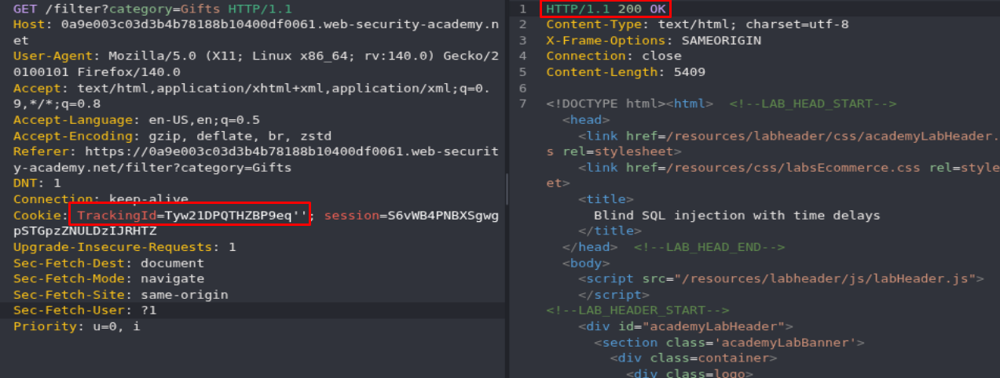
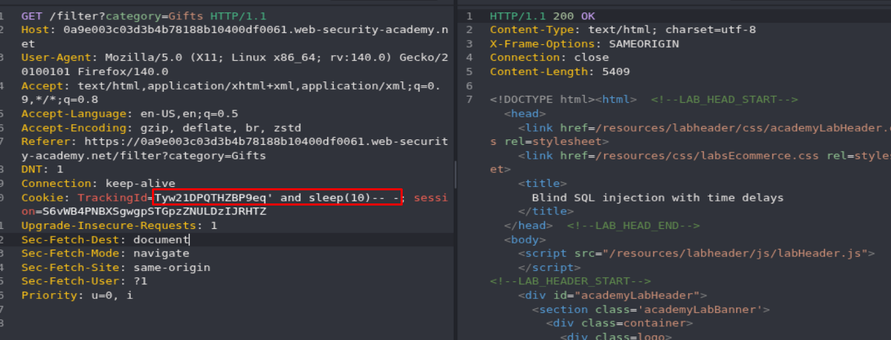
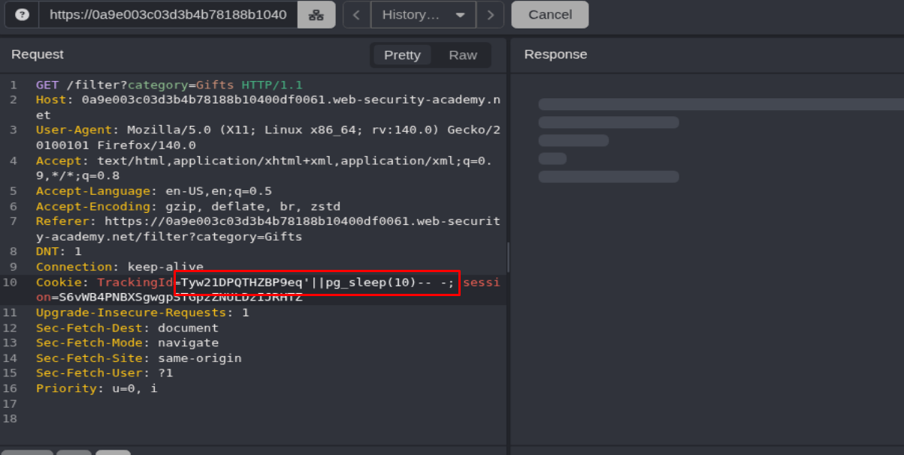
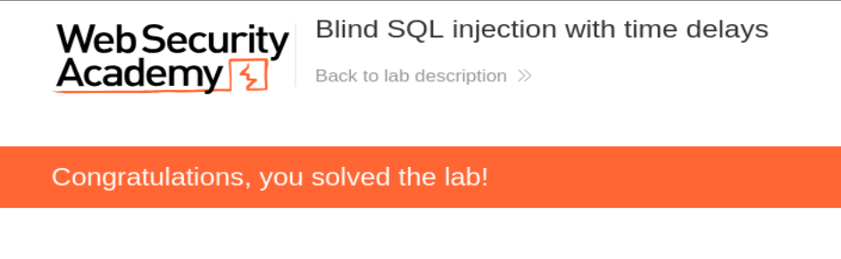

## SQL Injection with time delays

<p align="center">
  
</p>

Este tipo de ataque se utiliza cuando los métodos anteriores no han funcionado. Consiste en manipular una consulta para provocar que la aplicación tarde en responder unos segundos en función de si se cumple o no una determinada condición.

De esta forma, es posible inferir información de la base de datos midiendo los tiempos de respuesta del servidor. 

Si probamos a hacer lo mismo que en Conditional Error veremos que siempre da 200 OK:

<p align="center">
  
</p>

Vamos a imaginar que la base de datos puede ser MYSQL y probamos el siguiente payload:

```http
' and sleep(10)-- -
```

<p align="center">
  
</p>

La web no ha tardado 10 segundos, por lo que vamos a pensar que puede ser otra base de datos, probemos con PostgreSQL:

```http
'||pg_sleep(10)-- -
```

<p align="center">
  
</p>

Ahora la web si ha esperado 10 segundos y hemos resuelto el lab:

<p align="center">
  
</p>


